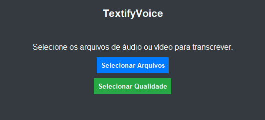

# TextifyVoice [Beta]

TextifyVoice é uma aplicação GUI (Interface Gráfica de Usuário) que permite transcrever arquivos de áudio e vídeo em texto utilizando o modelo Whisper da OpenAI. Ideal para transcrever entrevistas, palestras, aulas e outros conteúdos de áudio e vídeo em formato de texto de maneira fácil e rápida.

## Índice

- [Recursos](#recursos)
- [Capturas de Tela](#capturas-de-tela)
- [Requisitos](#requisitos)
- [Instalação](#instalação)
- [Como Usar](#como-usar)
- [Compilação do Executável](#compilação-do-executável)
- [Contribuição](#contribuição)
- [Licença](#licença)

## Recursos

- **Transcrição de Áudio e Vídeo**: Suporta diversos formatos como `.mp4`, `.mp3`, `.wav`, `.mkv`, `.aac`, `.flac`, `.m4a`, `.ogg`.
- **Interface Intuitiva**: Desenvolvido com Tkinter para proporcionar uma experiência amigável ao usuário.
- **Seleção de Qualidade do Modelo**: Escolha entre diferentes modelos de transcrição (small, medium, large) de acordo com suas necessidades.
- **Processamento em Lote**: Adicione múltiplos arquivos para transcrição em fila.
- **Gerenciamento de Transcrições**: Acompanhe o status de cada arquivo e acesse facilmente os resultados.
- **Personalização**: Possibilidade de selecionar e baixar modelos específicos do Whisper.

## Capturas de Tela



## Requisitos

- **Sistema Operacional**: Windows 7 ou superior.
- **Python**: 3.7 ou superior.
- **Dependências Python**:
  - `tkinter`
  - `whisper`
  - `torch`
  - `requests`
  - `python-docx`
  - `plyer`

- **FFmpeg**: O binário `ffmpeg.exe` deve estar disponível na pasta `bin` do projeto.

## Instalação

1. **Clone o Repositório**:

   ```bash
   git clone https://github.com/seu_usuario/textifyvoice.git
   cd textifyvoice
   ```

2. **Crie um Ambiente Virtual (Opcional, mas Recomendado)**:

   ```bash
   python -m venv venv
   venv\Scripts\activate  # No Windows
   # source venv/bin/activate  # No Linux/Mac
   ```

3. **Instale as Dependências**:

   ```bash
   pip install -r requirements.txt
   ```

   *Certifique-se de que o arquivo `requirements.txt` contém todas as dependências necessárias.*

4. **Configure o FFmpeg**:

   - Baixe o binário estático do FFmpeg em [ffmpeg.org](https://ffmpeg.org/download.html).
   - Coloque o arquivo `ffmpeg.exe` na pasta `bin` do projeto.

## Como Usar

1. **Execute o Aplicativo**:

   ```bash
   python your_script.py
   ```

2. **Selecione a Qualidade do Modelo**:

   - Ao abrir o aplicativo pela primeira vez, aparecerá a janela **"Selecionar Qualidade"**.
   - Escolha o modelo desejado (por exemplo, `medium`) e clique em **"Selecionar Modelo"**.
   - O modelo será baixado automaticamente. Aguarde até que o download seja concluído.

3. **Selecione Arquivos para Transcrição**:

   - Na tela principal, clique em **"Selecionar Arquivos"**.
   - Adicione os arquivos de áudio ou vídeo que deseja transcrever.
   - Os arquivos aparecerão em uma lista com o status **"Preparado"**.

4. **Inicie a Transcrição**:

   - Clique em **"Iniciar Transcrição"** para começar o processo.
   - Acompanhe o status de cada arquivo na lista:
     - **Preparado**: Pronto para transcrição.
     - **Aguardando processamento**: Na fila para ser transcrito.
     - **Em processamento...**: Transcrição em andamento.
     - **Finalizado**: Transcrição concluída com sucesso.
     - **Erro**: Ocorreu um problema durante a transcrição.
     - **Cancelado**: Transcrição cancelada pelo usuário.

5. **Visualize os Resultados**:

   - Após a transcrição ser finalizada, dê um duplo clique no arquivo com status **"Finalizado"**.
   - Isso abrirá o diretório onde o arquivo transcrito foi salvo.
   - Os arquivos transcritos são salvos na mesma pasta do arquivo original, com o sufixo `_text.docx`.

## Compilação do Executável

Para distribuir o aplicativo sem a necessidade de instalar o Python, você pode criar um executável usando o PyInstaller.

1. **Instale o PyInstaller**:

   ```bash
   pip install pyinstaller
   ```

2. **Prepare o Comando de Compilação**:

   - Certifique-se de que todos os caminhos estão corretos e que os arquivos necessários estão disponíveis.

3. **Crie o Executável**:

   ```bash
   pyinstaller --windowed --hidden-import=whisper --icon="./bin/icon.ico" \
   --add-data=".bin/ffmpeg.exe;bin" \
   --add-data="config.json;." \
   your_script.py
   ```

   **Explicação dos Parâmetros**:

   - `--windowed`: O executável será criado sem uma janela de console.
   - `--hidden-import=whisper`: Inclui o módulo `whisper` que pode não ser detectado automaticamente.
   - `--icon="./bin/icon.ico"`: Define o ícone do executável.
   - `--add-data`: Inclui arquivos adicionais necessários (como `ffmpeg.exe` e `config.json`).
   - `your_script.py`: O nome do arquivo principal do seu aplicativo.

4. **Distribua o Aplicativo**:

   - Após a compilação, a pasta `dist` conterá o executável.
   - Distribua essa pasta para os usuários.

## Contribuição

Contribuições são bem-vindas! Se você encontrar algum problema ou tiver sugestões, sinta-se à vontade para abrir uma [issue](https://github.com/seu_usuario/textifyvoice/issues) ou enviar um [pull request](https://github.com/seu_usuario/textifyvoice/pulls).

## Licença

Este projeto está licenciado sob os termos da licença MIT. Veja o arquivo [LICENSE](LICENSE) para mais detalhes.

---

**Nota**: Certifique-se de ajustar os comandos e caminhos de acordo com a estrutura real do seu projeto. Além disso, é recomendável adicionar o arquivo `requirements.txt` com todas as dependências e incluir capturas de tela para enriquecer o README.